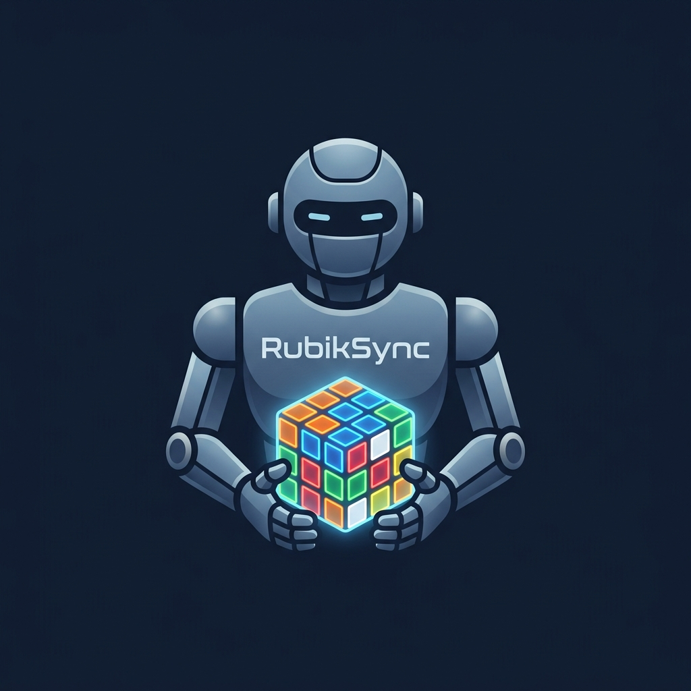

<p align="center">
  
</p>

# 🧩 RubikSync - Kotlin Multiplatform Rubik Küpü Çözücü & 3D Simülatör

**RubikSync**, Android, iOS ve Masaüstü (JVM) platformlarında çalışan; fiziksel Rubik Küpünüzü kamera aracılığıyla tarayarak saniyeler içinde **3D simülasyon ortamında çözüm adımlarını sunan** yenilikçi bir Kotlin Multiplatform mobil ve masaüstü uygulamasıdır.

Uygulama; gelişmiş renk analizi filtreleri, platforma özgü yerel kamera akışları, interaktif kılavuz çizgileri, zenginleştirilmiş 3D görselleştirme motoru ve en gelişmiş zeka küpü çözme algoritmalarından biri olan **Kociemba Algoritması**'nı bünyesinde barındırır.

---

## 🚀 Öne Çıkan Özellikler

### 1. 📷 Özel Kamera Arayüzü & Kare Hizalama Kılavuzu (Android & iOS)
- **Sistem Kamerasından Bağımsız:** Android tarafında **CameraX**, iOS tarafında **AVFoundation** mimarileri kullanılarak tamamen uygulama içi çalışan yerel kamera önizlemeleri geliştirilmiştir.
- **Kare Kılavuz Çerçevesi (Dashed Yellow):** Küpün tam hizalanması için ekranın en dar kenarını baz alan dinamik kare çerçeve.
- **3x3 Hizalama Izgarası (Green Grid):** Küpün 9 adet çıkartmasını (sticker) tam hizalamayı kolaylaştıran kılavuz çizgileri ve her çıkartmanın tam merkezinde yer alan yeşil örnekleme dots.
- **Flaş ve İptal Kontrolleri:** Işığın yetersiz olduğu durumlarda flaşı tek tuşla açıp kapatabilme özelliği.

### 2. 🎛️ İnteraktif 3x3 Kalibrasyon & İnce Ayar Sihirbazı
- **Slider Kontrolleri:** Çekilen fotoğrafın kılavuzla tam örtüşmemesi durumunda **Izgara Boyutu**, **Yatay Konum** ve **Dikey Konum** ayar sürgüleri ile yeşil ızgarayı fotoğrafın üzerinde canlı olarak kaydırabilme.
- **Seçici Piksel Filtrelemesi (Selective Averaging):** 
  - Küpün plastik siyah ızgara çizgilerinden gelen koyu pikseller (`RGB < 45`) filtrelenir.
  - Specular glare (ışık parlamaları) ve yansımalar (`MaxRGB > 250` ve renk farkı `< 15`) otomatik olarak ayıklanır.
- **Manuel Renk Düzeltme:** Algoritmanın algıladığı renklerde hata olması durumunda, 3x3 önizleme alanında hatalı hücreye dokunarak elle renk değiştirebilme imkanı.

### 3. 🎨 Gelişmiş CIE L*a*b* Renk Sınıflandırma
- Standart RGB uzaklığı yerine insan gözünün renkleri algılama biçimine en yakın olan **CIE L*a*b* renk uzayı** kullanılmıştır.
- Küpün 6 merkez rengi (Turuncu, Kırmızı, Sarı, Beyaz, Yeşil, Mavi) kalibrasyon referansı olarak kilitlenir. Diğer köşe ve kenar hücreleri, bu merkez renklere olan **Delta E (Euclidean Lab) uzaklığına** göre en doğru şekilde sınıflandırılır.

### 4. 🕹️ İnteraktif 3D Küp Simülatörü
- Sahne üzerinde fare veya dokunmatik hareketlerle **Orbit (Döndürme)**, **Zoom (Yakınlaştırma)** ve **Pan (Ölçekleme)** desteği.
- Küpün katmanlarını arayüzdeki butonlar veya 3D hareketlerle interaktif olarak döndürebilme.
- Çözüm adımlarının 3D model üzerinde adım adım animasyonlu olarak oynatılması.

### 5. 🎵 Gerçekçi Mekanik Ses Efektleri (Android)
- Küpün her dönüşünde (manuel çevirmeler, karıştırma (scramble) ve çözüm oynatma dahil) düşük gecikmeli **SoundPool** entegrasyonu ile sentezlenmiş **gerçekçi plastik zeka küpü dönüş sesi** çalınır.
- Ses durumu (`🔊` / `🔇`) kilit butonunun hemen yanındaki ses seviyesi butonuyla kontrol edilebilir ve **DataStore Preferences** üzerinden kalıcı olarak kaydedilir.

### 6. 🔐 Güvenli Düzenleme Kilidi (Editable Toggle)
- Üst paneldeki 34dp boyutlu kilit butonu (🔓/🔒) ile küpün döndürme özellikleri kilitlenebilir. Bu sayede, 3D model üzerinde inceleme (orbit/zoom/pan) yaparken yanlışlıkla dönüş hamlelerinin tetiklenmesi engellenir.
- Küp kilitlendiğinde, ses butonu da otomatik olarak inaktif hale gelir ve opaklığı azaltılarak görsel geri bildirim sağlanır.

### 7. 🛣️ Jetpack Compose Navigation Entegrasyonu
- Rotalar arası geçişler (Splash Screen -> Dashboard -> Settings) standard `NavHost`, `composable` ve `rememberNavController` mimarisine geçirilerek tamamen rota tabanlı hale getirilmiştir.
- Ekran geçişleri (özellikle Ayarlar ekranı) sağdan sola kayma (`slideInHorizontally`) ve fade geçiş animasyonları ile zenginleştirilmiştir.

### 8. 🔄 Standart Başlangıç Konumu
- Uygulama her başlatıldığında kamera açısı (yaw, pitch, distance, pan) önceki oturum ne olursa olsun standart "Sıfırla" konumunda açılır, böylece görsel tutarlılık korunur.

---

## 🛠️ Kullanılan Teknolojiler

| Alan | Kullanılan Kütüphane / Teknoloji | Açıklama |
| --- | --- | --- |
| **Çekirdek** | Kotlin Multiplatform (KMP) | Android, iOS ve JVM için ortak kod paylaşımı. |
| **Arayüz (UI)** | Compose Multiplatform | Bildirimsel (Declarative) ortak UI geliştirme ortamı. |
| **Android Kamera** | Jetpack CameraX (`1.3.4`) | `PreviewView`, `ImageCapture` yerel kamera yönetimi. |
| **iOS Kamera** | AVFoundation (`AVKit` / `UIKit`) | `AVCaptureSession` ve `AVCapturePhotoOutput` yerel iOS kamera yönetimi. |
| **Navigasyon** | Jetpack Compose Navigation KMP (`2.8.0-alpha10`) | Rota tabanlı KMP uyumlu ekran yönetimi ve geçiş animasyonları. |
| **Veritabanı** | Android Jetpack Room DB | SQLite tabanlı küp durumlarının kalıcı olarak saklanması. |
| **Ayarlar Kalıcılığı** | Jetpack DataStore Preferences | Ses, tema, dil ve kilit durumlarının anahtar-değer (K-V) kalıcılığı. |
| **Ses Motoru** | Android SoundPool API | Düşük gecikmeli yerel Android ses efekti motoru. |
| **Görsel İşleme** | Kotlin Native / Skia Graphics | Platform-specific görsellerin belleğe yüklenmesi ve piksel matrisine dönüştürülmesi. |
| **Algoritma** | Kociemba Algorithm | İki Fazlı (Two-Phase) optimum Rubik Küp çözücü algoritma. |

---

## 📂 Proje Dizin Yapısı

```bash
RubikSync/
├── androidApp/               # Android uygulaması giriş noktası, manifest ve yerel varlıklar.
├── iosApp/                   # Xcode projesi ve SwiftUI giriş katmanı.
│   └── iosApp/Info.plist     # iOS kamera kullanım izin beyanları (NSCameraUsageDescription).
├── scripts/
│   ├── detect_cube.py        # Masaüstü (JVM) platformunda yedek olarak çalışan Python algılama betiği.
│   └── generate_sound.py     # Gerçekçi Rubik küpü klik ve sürtünme sesi üreten sentezleyici script.
├── shared/                   # Ortak kodların yer aldığı ana KMP modülü.
│   ├── build.gradle.kts      # Modül bağımlılıkları, Room ve KMP Navigation yapılandırmaları.
│   └── src/
│       ├── commonMain/       # Android, iOS ve JVM tarafından ortak kullanılan sınıflar.
│       │   └── kotlin/com/vahitkeskin/rubiksync/
│       │       ├── App.kt    # Ana uygulama yönetimi, NavHost navigasyon rotaları.
│       │       ├── Platform.kt # Platforma özgü expect tanımlamaları (ses ve kamera).
│       │       └── cube/
│       │           ├── RubikCube.kt           # 3D Küp çizimi, 3D rotasyon fiziği ve ses tetikleyici.
│       │           ├── RubikSolver.kt         # Kociemba çözücü algoritması implementasyonu.
│       │           ├── RubikImageProcessor.kt # CIE L*a*b* renk mesafe ve piksel filtreleme mantığı.
│       │           └── GestureHandler.kt      # 3D sahne dokunmatik yönlendirme kontrolörü.
│       ├── androidMain/      # Android platformuna özgü yerel implementasyonlar.
│       │   └── kotlin/com/vahitkeskin/rubiksync/Platform.android.kt # CameraX ve SoundPool actual implementasyonları.
│       ├── iosMain/          # iOS platformuna özgü yerel implementasyonlar.
│       │   └── kotlin/com/vahitkeskin/rubiksync/Platform.ios.kt     # AVFoundation & UIKitView entegrasyonu.
│       └── jvmMain/          # Masaüstü (JVM) platformuna özgü yerel implementasyonlar.
│           └── kotlin/com/vahitkeskin/rubiksync/Platform.jvm.kt     # AWT FileDialog dosya seçici fallback.
└── gradle/
    └── libs.versions.toml    # Projedeki tüm kütüphanelerin sürüm kataloğu.
```

---

## 📱 Ekranların Detaylı Tanıtımı

### 1. Ana Ekran & 3D İnteraktif Simülasyon
- Uygulama açıldığında kullanıcıyı karşılayan 3D küp görünümüdür.
- Kullanıcı küpü elle karıştırabilir, katmanları sağa-sola döndürebilir.
- Ekranın üst kısmında küpün çözülmesi için gerekli hamle sayısı yer alır.
- **"Tara ve Çöz"** butonuna basılarak tarama sihirbazı başlatılır.
- Küp başarıyla tarandıktan sonra **"Çözümü Oynat"** butonu aktifleşir ve küpün adım adım çözüm animasyonu başlar. Hamle hızı kaydırıcı yardımıyla canlı olarak ayarlanabilir.

### 2. Özel Kamera Tarama Ekranı (Kamera Diyaloğu)
- **"Fotoğraf Çek"** butonuna basıldığında açılan tam ekran arayüzdür.
- Sarı kesikli bir kare çerçeve ve yeşil 3x3 ızgara çizgileri canlı kamera görüntüsünün üzerine bindirilir.
- Kullanıcı küpü tam kare çerçevenin içine hizalayarak ortadaki deklanşör butonuyla çekimi gerçekleştirir. Flaş ikonuyla karanlık ortamlarda aydınlatma sağlanabilir.
- Çekim yapıldıktan sonra fotoğraf otomatik olarak merkezi bir kareye kırpılarak kalibrasyon ekranına aktarılır.

### 3. Hizalama ve Renk Kalibrasyon Arayüzü
- Fotoğraf çekildikten veya galeriden seçildikten sonra otomatik olarak açılır.
- Fotoğrafın üzerinde yeşil renkte ızgara çizgileri ve örnekleme kareleri (`patch`) gösterilir.
- Sürgülerle (Sliders) ızgara küpün üzerine tam oturtulur.
- Algılanan 3x3 renk dağılımı görsel olarak hemen altta listelenir. Eğer herhangi bir renk yanlış algılanmışsa kullanıcı o hücreye dokunarak listeden doğru rengi seçebilir.
- **"Onayla"** butonuna basıldığında o yüzün renk dağılımı kaydedilir ve bir sonraki yüze geçilir. 6 yüz de tarandığında Kociemba çözücü algoritması arka planda çalışarak çözümü üretir.

---

## 📐 Algoritmalar ve Yüksek Matematik Detayları

### 1. 3D Uzay Rotasyonu ve Rodrigues Rotasyon Formülü
3D simülasyondaki her bir küp parçacığının (cubie) konumu ve yönelimi dönüşler sırasında güncellenir. Bir parçacığın konum vektörünü ($\mathbf{v}$), dönme ekseni ($\mathbf{k}$) etrafında $\theta = \pi/2$ radyan (90 derece) kadar döndürmek için **Rodrigues Rotasyon Formülü** kullanılır:

$$\mathbf{v}' = \mathbf{v} \cos\theta + (\mathbf{k} \times \mathbf{v}) \sin\theta + \mathbf{k} (\mathbf{k} \cdot \mathbf{v}) (1 - \cos\theta)$$

Burada:
- $\mathbf{v}'$ dönme sonrası yeni konum vektörüdür.
- $\mathbf{k}$ birim dönme eksenidir: $X$ ekseni için $(1,0,0)$, $Y$ ekseni için $(0,1,0)$, $Z$ ekseni için $(0,0,1)$.
- $\times$ çapraz çarpımı (cross product), $\cdot$ ise nokta çarpımı (dot product) temsil eder.

Aynı zamanda her cubie'nin kendi lokal yönelim vektörleri (`rightBasis`, `upBasis`, `forwardBasis`) de bu formülle döndürülerek 3D uzaydaki oryantasyon matrisi güncellenir.

### 2. Kayan Nokta Sapmasının (Floating-Point Drift) Önlenmesi
Compose her kareyi render ederken, ardışık trigonometrik matris çarpımları nedeniyle kayan nokta koordinatlarında ufak sapmalar (örneğin $0.99998f$ yerine $1.0f$) meydana gelir. Bu sapmaların zamanla birikip küpün 3D geometrisini bozmasını engellemek için her dönüş tamamlandığında koordinatlar en yakın yarım veya tam sayıya yuvarlanır:

```kotlin
private fun Float.roundToHalfOrWhole(): Float {
    return (this * 2f).roundToInt() / 2f
}
```

### 3. Grup Teorisi ve Kociemba İki Fazlı Arama Algoritması
Rubik Küpü grubu ($G$), 12 kenar ve 8 köşenin permütasyon ve yönelimleri ile tanımlanan bir matematiksel gruptur ve toplam mertebesi:

$$|G| = 8! \cdot 3^7 \cdot 12! \cdot 2^{10} \approx 4.32 \times 10^{19}$$

Kociemba algoritması, bu devasa arama uzayını çözmek için **Coset Search (Eşküme Araması)** mantığını kullanarak çözümü iki faza ayırır:
- **Phase 1 (G0 -> G1):** Küpün köşelerinin yönelimlerini ve kenarlarının yönelimlerini düzelterek durumu $G_1$ alt grubuna sokar. Bu alt grup yalnızca şu dönüşlerle üretilir:
  $$G_1 = \langle U, D, R^2, L^2, F^2, B^2 \rangle$$
- **Phase 2 (G1 -> Çözülmüş Durum):** Yalnızca $G_1$ alt grubunun üreteçlerini (yarım dönüşler ve tam U/D dönüşleri) kullanarak küpü tamamen çözer. Bu iki fazlı arama ağacı en fazla 20-22 hamlede optimum çözümü garanti eder.

### 4. CIE L*a*b* Dönüşüm Formülü ve Delta E Renk Mesafesi
Uygulama, RGB piksellerini öncelikle XYZ uzayına, ardından insan gözüne uyumlu CIE L*a*b* uzayına dönüştürür:

$$\begin{aligned}
L^* &= 116 \cdot f(Y/Y_n) - 16 \\
a^* &= 500 \cdot [f(X/X_n) - f(Y/Y_n)] \\
b^* &= 200 \cdot [f(Y/Y_n) - f(z/Z_n)]
\end{aligned}$$

Her bir sticker pikselinin $L^*a^*b^*$ değeri, küpün kilitli 6 merkez renginin $L^*a^*b^*$ referans değerleriyle karşılaştırılır. En küçük Öklid uzaklığına (Delta E) sahip olan referans renk, o sticker'ın rengi olarak tayin edilir:

$$\Delta E^* = \sqrt{(\Delta L^*)^2 + (\Delta a^*)^2 + (\Delta b^*)^2}$$

---

## 🛠️ Kurulum ve Çalıştırma

### Gereksinimler
- macOS işletim sistemi (iOS derlemesi yapabilmek için).
- Android Studio / Xcode.
- Java JDK 17+.

### Çalıştırma Komut komutları

#### 🤖 Android
```bash
# Android uygulamasını derleyin ve cihazda/emülatörde çalıştırın
./gradlew :androidApp:installDebug
```

#### 🍏 iOS
1. Xcode ile `/iosApp/iosApp.xcodeproj` dosyasını açın.
2. Hedef cihazı seçin (Simulator veya Fiziksel Cihaz).
3. **Run (Cmd+R)** butonuna basarak derleyin.
*(KMP modül derlemesi Xcode build phases üzerinden otomatik olarak Gradle aracılığıyla tetiklenir).*

#### 💻 Masaüstü (JVM)
```bash
# Masaüstü uygulamasını çalıştırın
./gradlew :desktopApp:run
```

---

> **[!NOTE]**
> RubikSync projesi, Kotlin Multiplatform ve Compose Multiplatform'un gücünü, gelişmiş matematiksel renk modelleri ve 3D grafik kütüphaneleriyle birleştiren üst seviye bir mühendislik çalışmasıdır.