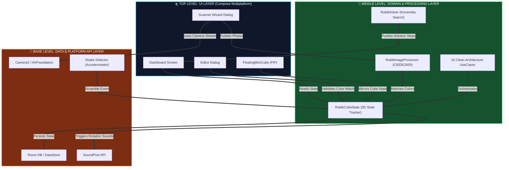

<p align="center">
  
</p>

<h1 align="center">🧩 RubikSync</h1>
<h3 align="center">🚀 Kotlin Multiplatform Rubik Küpü Çözücü & 3D İnteraktif Simülatör</h3>

<p align="center">
  
  
  
  
  
  
  
</p>

---

📱 **RubikSync**, Android, iOS ve Masaüstü (JVM) platformlarında çalışan; fiziksel Rubik Küpünüzü kamera veya galeri aracılığıyla tarayarak saniyeler içinde **3D simülasyon ortamında çözüm adımlarını sunan** yenilikçi bir Kotlin Multiplatform mobil ve masaüstü uygulamasıdır.

🤖 Uygulama; gelişmiş renk analizi filtreleri, platforma özgü yerel kamera akışları, interaktif kılavuz çizgileri, zenginleştirilmiş 3D görselleştirme motoru ve en gelişmiş zeka küpü çözme algoritmalarından biri olan **Kociemba Algoritması**'nı bünyesinde barındırır.

🌍 **19 farklı dilde** tam çeviri desteği (🇹🇷 TR, 🇬🇧 EN, 🇩🇪 DE, 🇫🇷 FR, 🇪🇸 ES, 🇷🇺 RU, 🇯🇵 JA, 🇨🇳 ZH, 🇰🇷 KO, 🇮🇳 HI, 🇸🇦 AR, 🇦🇿 AZ, 🇧🇷 PT, 🇮🇩 ID, 🇮🇹 IT, 🇳🇱 NL, 🇻🇳 VI, 🇹🇭 TH, 🇵🇱 PL) ile sunulmaktadır.

---

## ✨ Öne Çıkan Özellikler

### 📷 Görüntü İşleme & Kamera Yönetimi
* 📷 **Özel Kamera Arayüzü (Android & iOS):** Sistem kamerasından bağımsız olarak Android tarafında **CameraX**, iOS tarafında **AVFoundation** mimarileriyle yerel kamera önizlemeleri ve çekim kontrolleri sunulur.
* 📐 **Kare Hizalama Izgarası:** Ekranın en dar kenarını baz alan dinamik dashed kare çerçeve ve 9 adet çıkartmanın (sticker) tam merkezinde yer alan yeşil örnekleme dots.
* ⚙️ **İnteraktif Kalibrasyon Sihirbazı:** Fotoğraf çekildikten veya galeriden yüklendikten sonra **Izgara Boyutu**, **Yatay Konum** ve **Dikey Konum** sürgüleriyle yeşil ızgaranın piksel koordinatları ince ayarlanabilir.
* 🧼 **Seçici Piksel Filtrelemesi (Selective Averaging):** Plastik siyah ızgara çizgileri (`RGB < 45`) ile parlama ve yansımalar (`MaxRGB > 250`) otomatik olarak filtrelenerek temiz piksel renk ortalamaları toplanır.
* 🌈 **Gelişmiş Renk Sınıflandırma:** İnsan gözünün renkleri algılama biçimine en yakın olan **CIE L*a*b*** renk uzayı ve merkez renkler referans alınarak hesaplanan **CIEDE2000 (Delta E 2000)** formülüyle gölge ve yansımalardan arındırılmış kararlı renk eşlemeleri yapılır.
* 🔍 **Otomatik Yüz Algılama (Face Detection):** Çekilen fotoğraftaki merkez sticker rengi analiz edilerek küpün hangi yüzünün tarandığı otomatik olarak tespit edilir. Kullanıcının hangi yüzü taradığını manuel seçmesine gerek kalmaz.
* ✏️ **Otomatik Hata Düzeltme & Doğrulama:** Tarama tamamlandığında 54-renk haritası [RubikCubeState](file:///shared/src/commonMain/kotlin/com/vahitkeskin/rubiksync/ui/state/RubikAppState.kt) durumuna aktarılır. Küp çözülebilirse pencereler otomatik kapanır, hatalı ise [EditorScreen.kt](file:///shared/src/commonMain/kotlin/com/vahitkeskin/rubiksync/ui/screens/editor/EditorScreen.kt) hata şeridiyle açık kalır ve elle renk düzeltmesine imkan tanır.
* 🟧 **Karışık Küp Merkez Renk Önizlemesi:** Tarama ekranında kullanıcıya küçük bir 3x3 mini grid gösterilir. Etraftaki sticker'lar karışık renklerde gösterilirken, merkez sticker kalın çerçeve ve nokta ile vurgulanarak "bu rengi bul" mesajı verilir.

### 🎨 3D Grafik & Simülasyon Motoru
* 🌐 **İnteraktif 3D Küp:** Compose Multiplatform Canvas üzerinde çalışan; fare veya dokunmatik hareketlerle serbestçe döndürülebilen (**Orbit**), yakınlaştırılabilen (**Zoom**) ve kaydırılabilen (**Pan**) 3D modelleme.
* ⏯️ **Çözüm Oynatıcı:** Çözüm adımlarının 3D model üzerinde animasyonlu olarak oynatılması, hamle hızının kaydırıcı yardımıyla canlı olarak ayarlanabilmesi.
* 🧱 **27 Cubie Sistemi:** Her bir küp parçacığı (cubie) bağımsız konum vektörü, yönelim matrisi ve 6 yüz renk bilgisi ile modellenmiştir. Toplam 27 cubie × 6 yüz = 162 sticker yüzeyi gerçek zamanlı render edilir.
* 🖌️ **Dinamik Gölgeleme (Lambertian Shading):** Yüzey normalleri ile sanal ışık kaynağı arasındaki açıya göre her sticker'a gerçekçi gölgeleme uygulanır.
* 🎭 **Ressam Algoritması (Painter's Algorithm):** Z-derinliğine göre sıralama ve backface culling ile doğru çizim sırası garanti edilir.
* 🧭 **Dinamik Rehber Küp (Guide Cube):** [CubeRotationGuide.kt](file:///shared/src/commonMain/kotlin/com/vahitkeskin/rubiksync/cube/CubeRotationGuide.kt) ile tarama adımlarında kameranın taranan yüze en kısa açısal yoldan ($\Delta\theta \le \pi$ normalizasyonu ile) dönmesi ve taranmış tüm yüzlerin renklerinin kılavuz üzerinde kalıcı olarak gösterilmesi.
* 🔓 **Katman Dönüş Kilidi & İki Parmakla Genel Döndürme:** Tek parmakla küp üzerindeki bir çıkartma sürüklendiğinde tüm küpün dönmesi engellenir (Katman Dönüş Kilidi). Kullanıcı istediği an iki parmağını ekranda sürükleyerek küpü serbestçe kendi etrafında döndürebilir ve arkasını/altını kolayca inceleyebilir.

### 🔮 FloatingMiniCube — Picture-in-Picture 3D Çözüm İzleme

📌 **[FloatingMiniCube.kt](file:///shared/src/commonMain/kotlin/com/vahitkeskin/rubiksync/ui/components/FloatingMiniCube.kt)**, çözüm oynatılırken kullanıcı ayarlar gibi farklı bir ekrana geçtiğinde 3D küpün küçültülmüş bir kopyasını ekranın köşesinde gösteren **Picture-in-Picture (PiP)** bileşenidir.

#### 🎯 Temel Özellikler
* 🪄 **Morph Animasyonu:** Küp, ana ekrandaki tam boyutlu konumundan (mainCubeBounds) sağ alt köşedeki mini boyutuna doğru 650ms boyunca **boyut + konum + opaklık** geçişi ile pürüzsüzce küçülür. Bu süreçte hem genişlik/yükseklik hem de x/y koordinatları eşzamanlı olarak interpolate edilir.
* 🖐️ **Sürüklenebilir (Draggable):** Geçiş animasyonu %95 tamamlandıktan sonra PiP penceresi serbest sürükleme moduna geçer. Kullanıcı penceresini ekranın herhangi bir yerine taşıyabilir (`detectDragGestures`).
* 🛡️ **Güvenli Alan Sınırlandırması (Safe Area Clamping):** Status bar, navigation bar ve ekran kenar boşlukları hesaplanarak PiP penceresi her zaman görünür alanda kalır.
* 📊 **İlerleme Çubuğu:** Alt kenarda turuncu → mavi gradient ilerleme çubuğu çözümün kaçıncı adımda olduğunu gösterir (`currentStep / totalSteps`).
* 🏷️ **Adım Sayacı Badge:** Sol üst köşede yarı saydam arka planlı `currentStep/totalSteps` etiketi.
* ❌ **Kapatma Butonu:** Sağ üst köşede ✕ butonu ile çözüm iptal edilip PiP kapatılabilir.
* 🎨 **Tema Uyumlu:** Karanlık temada yarı saydam (`alpha = 0.85`), aydınlık temada opak arka plan. Gölge yüksekliği de temaya göre ayarlanır (Dark: 8dp, Light: 2dp).
* 🔄 **Otomatik Sıfırlama:** PiP tam kapandığında (`transitionProgress = 0`) sürükleme offset'leri otomatik sıfırlanır.

#### 🧮 FloatingMiniCube Matematik Modeli
📐 PiP penceresinin boyut ve konum geçişi parametrik bir enterpolasyon fonksiyonu ile hesaplanır:
<div style="overflow-x: auto; overflow-y: hidden;">

$$W(t) = W_{\text{start}} + (W_{\text{pip}} - W_{\text{start}}) \cdot t, \quad H(t) = H_{\text{start}} + (H_{\text{pip}} - H_{\text{start}}) \cdot t$$

</div>

<div style="overflow-x: auto; overflow-y: hidden;">

$$X(t) = X_{\text{start}} + (X_{\text{end}} - X_{\text{start}}) \cdot t, \quad Y(t) = Y_{\text{start}} + (Y_{\text{end}} - Y_{\text{start}}) \cdot t$$

</div>

🕰️ Burada $t \in [0, 1]$ Animatable ile `FastOutSlowInEasing` easing fonksiyonu üzerinden kontrol edilir.

### 🎧 Akustik Sentez & Kullanıcı Deneyimi
* 🔊 **Gerçekçi Mekanik Ses Efektleri:** Küpün her dönüşünde (manuel çevirmeler, karıştırma (scramble) ve çözüm oynatma dahil) düşük gecikmeli **SoundPool** entegrasyonu ile sentezlenmiş keskin plastik zeka küpü dönüş sesi çalınır.
* 🔒 **Güvenli Düzenleme Kilidi (Editable Toggle):** Üst paneldeki kilit butonu (🔓/🔒) ile küpün döndürme özellikleri kilitlenebilir. Bu sayede, 3D model üzerinde inceleme (orbit/zoom/pan) yaparken yanlışlıkla dönüş hamlelerinin tetiklenmesi engellenir.
* 📳 **Sallayarak Karıştırma (Shake to Scramble):** Cihaz sallandığında küp otomatik olarak karıştırılır. Bu özellik üst paneldeki 📳/📱 butonu ile açılıp kapatılabilir.
* 🏆 **En İyi Süreler (Best Times):** Kullanıcının çözüm performansları kaydedilir ve en iyi süreler hamle sayısıyla birlikte listelenir.

### 💡 Gelişmiş Tanıtım ve Bilgi Balonu Sistemi
* 💬 **Merkezi Aktif Tooltip Yönetimi (`AuraBalloon`):** Uzun basışta veya tanıtım ekranlarında açılan bilgi balonları, boşluğa veya başka bir arayüz elemanına tıklandığında otomatik olarak kapanır (`dismissOnClickOutside`). Aynı anda birden fazla balonun üst üste binmesini engellemek için tekil bir aktif balon kimliği (`activeTooltipId`) üzerinden yönetilir.
* 🎯 **Statik Arayüz Elemanı Odaklama (Spotlight Focus):** Jetpack Compose'un statik tasarımlarda yeniden yerleşim tetiklememe kısıtını aşmak için, tanıtılacak her elemanın koordinatları adım bazlı bağımsız ölçüm state'leri (`boundsStep1`, `boundsStep2` vb.) aracılığıyla koşulsuz toplanır. Böylece, tanıtım adımı değiştiği an ilgili bileşen gri karartma arka planı üzerinde tam hedef aydınlatması ile odaklanır.
* 📜 **Dinamik Görünürlük Kesişim Algoritması (Vertical Viewport Overlap):** `showcaseScannerSliders` ve `showcaseScannerPreview` gibi kaydırılabilir alanlarda yer alan elemanlar ekranın dışında ise balonları gizli tutulur. Sayfa otomatik olarak kaydırılıp hedef eleman görünür alana (viewport) girince (en az 10 piksellik dikey kesişim doğrulandığında ve scroll bittiğinde) bilgi balonu yavaşça ve pürüzsüzce fade-in animasyonuyla belirir.

### 🎨 Küp Tasarımcısı & Editör
* 🖌️ **Elle Boyama Modu:** 6 renk paletinden seçim yaparak küpün her yüzündeki sticker'ları tek tek boyayabilirsiniz.
* 📋 **JSON İçe Aktarma:** Küp durumunu JSON formatında dışarıdan yapıştırarak anında yükleyebilirsiniz.
* 📷 **Kamera ile Tarama Sihirbazı:** 6 yüzü kamera/galeri ile tarattırıp otomatik algılatabilirsiniz.
* 🗺️ **Mini Ağ Haritası (Mini Net Map):** Küpün 6 yüzünü açılmış kutu formatında tek seferde görebilirsiniz.

### 📢 Geri Bildirim Sistemi (FeedbackOverlay)
* ❌ **Hata Bannerleri:** Kırmızı gradient ile slide-in animasyonlu hata mesajları (4 saniye otomatik kapanır).
* ✅ **Başarı Bannerleri:** Yeşil gradient ile başarılı işlem bildirimleri (3 saniye otomatik kapanır).
* ℹ️ **Bilgi Bannerleri:** Mavi gradient ile bilgilendirme mesajları.

---

## 📂 Proje Paket Yapısı (Package Structure)

🌲 Projenin modüler KMP (Kotlin Multiplatform) yapısı, **120+ Kotlin kaynak dosyası** ile aşağıda özetlenmiştir:

```
📂 RubikSync (Root)
├── 🤖 androidApp (Android Native Runner)
├── 🍏 iosApp (iOS Native Runner)
├── 💻 desktopApp (Desktop JVM Native Runner)
└── 📦 shared (KMP Shared Core Module)
    └── 📂 src/commonMain/kotlin/com/vahitkeskin/rubiksync
        ├── 🌌 App.kt (Global UI Root & Screen NavHost)
        ├── 📡 Platform.kt (expect/actual Kamera, Ses, Dosya, Shake API)
        ├── 🎨 cube/ (3D Renderer, Projections & Image Processing Engine)
        │   ├── 📐 CubeRenderer.kt (3D Canvas Draw Loop & Lambertian Shading)
        │   ├── 🎥 CubeScreenProjector.kt (3D → 2D Perspektif Projeksiyon)
        │   ├── 🧭 CubeRotationGuide.kt (Scanner Guide Assistant & Idle Breathing)
        │   ├── 🌈 RubikImageProcessor.kt (sRGB→LAB, CIEDE2000, Hungarian)
        │   ├── 🧮 Math3D.kt (Rodrigues Formülü & Vektör İşlemleri)
        │   ├── 🎬 CubeEasing.kt (Animasyon Easing Fonksiyonları)
        │   ├── 🔳 CubeStickerGeometry.kt (Rounded Sticker Köşe Noktaları)
        │   ├── 🔄 CubieTransform.kt (Konum & Yönelim Matrisleri)
        │   ├── 🖱️ GestureHandler.kt (Tek/İki Parmak Dokunma Yönetimi)
        │   ├── 🎯 LayerMoveSelector.kt (Katman Seçim & Dönüş Tespit)
        │   ├── 📏 MoveMathHelper.kt (Dönüş Eksenleri & Açı Hesaplama)
        │   └── 🧊 RubikCube.kt (27 Cubie State Machine & Move Executor)
        ├── 💾 data/ (Room Database & DataStore Preferences Persistence)
        │   └── 📁 repository/
        │       ├── 🗄️ CubeRepositoryImpl.kt (Küp Durumu CRUD)
        │       └── ⚙️ SettingsRepositoryImpl.kt (Ayarlar Kalıcılığı)
        ├── 🔌 di/ (Koin Dependency Injection Configuration)
        │   └── 💉 Koin.kt (16 UseCase + Repository Factory Tanımları)
        ├── 👑 domain/ (Core Cube Constants & Color Enumerations)
        │   ├── 📁 repository/ (Repository Interfaces)
        │   └── 📁 usecase/ (16 Clean Architecture Use Case)
        │       ├── 🎯 GetCubeStateUseCase.kt
        │       ├── 💾 SaveCubeStateUseCase.kt
        │       ├── 🎨 SaveThemeUseCase.kt
        │       ├── 🌐 SaveLanguageUseCase.kt
        │       ├── 🔊 SaveSoundEnabledUseCase.kt
        │       ├── 📳 SaveShakeToScrambleUseCase.kt
        │       ├── 📷 SaveCameraSettingsUseCase.kt
        │       ├── 🏆 SaveSolveSessionUseCase.kt
        │       └── 🎓 SaveShowcaseCompletedUseCase.kt (+ 7 diğer)
        ├── 🚀 solver/ (Kociemba Two-Phase Optimal Search Solver)
        │   ├── 🔑 RubikSolver.kt (IDA* Coset Search Engine — 34KB)
        │   ├── 📸 CubeSnapshot.kt (Küp Anlık Durum Çıkarımı)
        │   ├── 🔍 Bfs.kt (Breadth-First Search Pruning Table Üreteci)
        │   ├── ✂️ OptimizeMoves.kt & OptimizeAnnotatedMoves.kt
        │   ├── 🗜️ CompressMoves.kt & CompressAnnotatedMoves.kt
        │   └── 🧪 ParseAlgorithm.kt (Notasyon Ayrıştırıcı)
        ├── 🎭 ui/ (Compose Screens, Custom Balloons, Theme & L10n Strings)
        │   ├── 💬 components/
        │   │   ├── 💭 AuraBalloon.kt (Tooltip & Showcase Balloon Sistemi)
        │   │   ├── 🔮 FloatingMiniCube.kt (PiP 3D Çözüm İzleme)
        │   │   ├── 📢 FeedbackOverlay.kt (Hata/Başarı/Info Bannerleri)
        │   │   └── 🔧 RubikToolbar.kt (Özel Başlık Çubuğu)
        │   ├── 🎮 controlpanel/
        │   │   ├── 🕹️ ControlPanel.kt (Hareketler, Eylemler, AI Sekmeleri)
        │   │   ├── 🔢 MovesGrid.kt (U/D/L/R/F/B Hamle Izgarası)
        │   │   ├── ⏯️ PlaybackController.kt (Çözüm Animasyon Kontrolcüsü)
        │   │   └── ⏱️ SpeedControl.kt (Hamle Hızı Ayarı)
        │   ├── 🧊 cube/
        │   │   ├── 🎬 CubeAnimationFrameSync.kt (Kare Senkronizasyonu)
        │   │   ├── 🎨 FaceGrid.kt (2D Yüz Izgarası)
        │   │   └── 🖥️ InteractiveCubeCanvas.kt (3D Dokunmatik Küp)
        │   ├── 📊 dashboard/
        │   │   └── 🏠 DashboardHeader.kt (Ana Ekran Başlığı & Kontroller)
        │   ├── 🖼️ icons/ (Özel İkon Bileşenleri)
        │   ├── 📁 screens/
        │   │   ├── 🚀 splash/ → SplashScreen.kt
        │   │   ├── ⚙️ settings/ → SettingsScreen.kt + ThemeOptionCard.kt
        │   │   ├── 🎨 editor/ → EditorScreen.kt + 9 Alt Bileşen
        │   │   └── 📷 scanner/ → ScannerScreen.kt + 7 Alt Bileşen
        │   ├── 🏛️ state/
        │   │   ├── 🧠 RubikAppState.kt (Global Uygulama Durumu — 27KB)
        │   │   ├── 🎨 Color.kt (154 Satırlık Profesyonel Palet Sistemi)
        │   │   ├── 🌙 RubikColors.kt (Dark/Light Tema Renk Şeması)
        │   │   ├── 🖥️ PipManager.kt (PiP Durum Yönetimi)
        │   │   └── 🎭 ThemeMode.kt (Light/Dark/System Enum)
        │   └── 🌐 strings/ (19 Dil Dosyası × 148 String = 2,812 Çeviri)
        └── 🛠️ utils/
            ├── 👆 ClickExtensions.kt (Long-Press & Click Yardımcıları)
            ├── 🔗 Extensions.kt (Utility Extensions)
            ├── 💾 Persistence.kt (Platform Kalıcılık Arayüzü)
            └── 🔄 RubikStateParser.kt (Küp Durumu Ayrıştırıcı)
```

---

## 🏛️ 3D Stack Mimari Modeli (Layered Architecture Stack)

🧱 Sistem mimarisi, donanım katmanından arayüze doğru dikey olarak katmanlanmış bir 3D yığın (stack) modelidir:



---

## 📊 Matematiksel Temeller ve Algoritmalar

### 📐 1. 3D Uzay Dönüşleri, Kuaterniyonlar ve Rodrigues Formülü
🔄 3D simülasyondaki her bir küp parçacığının (cubie) konumu ve yönelimi dönüşler sırasında güncellenir. Bir parçacığın konum vektörünü ($\mathbf{v}$), dönme ekseni ($\mathbf{u}$) etrafında $$\theta = \pi/2$$ radyan (90 derece) kadar döndürmek için **Rodrigues Rotasyon Formülü** kullanılır:
<div style="overflow-x: auto; overflow-y: hidden;">

$$\mathbf{v}' = \mathbf{v} \cos\theta + (\mathbf{u} \times \mathbf{v}) \sin\theta + \mathbf{u} (\mathbf{u} \cdot \mathbf{v}) (1 - \cos\theta)$$

</div>
📍 Burada $\mathbf{v}'$ dönme sonrası yeni konum vektörünü, $\mathbf{u}$ normalize edilmiş dönme eksenini, $\times$ çapraz çarpımı ve $\cdot$ ise nokta çarpımı temsil eder.

#### 🎥 Kamera Projeksiyon Modeli
📹 Kameranın 3D uzaydaki koordinatları ekran alanına yansıtılırken [CubeScreenProjector.kt](file:///shared/src/commonMain/kotlin/com/vahitkeskin/rubiksync/cube/CubeScreenProjector.kt) sınıfı tarafından aşağıdaki matematiksel dönüşüm matrisleri uygulanır:
<div style="overflow-x: auto; overflow-y: hidden;">

$$\mathbf{v}_{\text{camera}} = R_x(\phi) R_y(\theta) \mathbf{v}_{\text{world}}$$

</div>

<div style="overflow-x: auto; overflow-y: hidden;">

$$R_y(\theta) = \begin{bmatrix} \cos\theta & 0 & \sin\theta \\ 0 & 1 & 0 \\ -\sin\theta & 0 & \cos\theta \end{bmatrix}, \quad R_x(\phi) = \begin{bmatrix} 1 & 0 & 0 \\ 0 & \cos\phi & -\sin\phi \\ 0 & \sin\phi & \cos\phi \end{bmatrix}$$

</div>

<div style="overflow-x: auto; overflow-y: hidden;">

$$\text{depth} = d + z_c, \quad \text{scale} = \frac{f}{\text{depth}}$$

</div>

<div style="overflow-x: auto; overflow-y: hidden;">

$$x_{\text{screen}} = \frac{W}{2} + \text{pan}_x + x_c \cdot \text{scale}, \quad y_{\text{screen}} = \frac{H}{2} - \text{pan}_y - y_c \cdot \text{scale}$$

</div>


#### 🔄 Kamera Açıları En Kısa Yol Normalizasyonu (Shortest-Path Interpolation)
🧭 Kamera açısı geçişleri sırasında oluşan sarsıntıları engellemek için, hedef açı ile mevcut açı arasındaki fark en kısa rotasyon yönüne normalize edilir:
<div style="overflow-x: auto; overflow-y: hidden;">

$$\Delta\theta = \operatorname{atan2}(\sin(\theta_{\text{target}} - \theta_{\text{current}}), \cos(\theta_{\text{target}} - \theta_{\text{current}}))$$

</div>
🌍 Bu sayede yaw geçişleri hiçbir zaman $\pi$ radyandan (180 derece) daha fazla dönmez, ters yönden en kısa yolu tercih eder.

#### 🎨 Lambertian Aydınlatma Modeli
💡 Her sticker yüzeyine uygulanan gölgeleme, yüzey normali ($\mathbf{n}$) ile ışık yönü ($\mathbf{l}$) arasındaki açıya bağlıdır:
<div style="overflow-x: auto; overflow-y: hidden;">

$$I = I_{\text{ambient}} + I_{\text{diffuse}} \cdot \max(0, \mathbf{n} \cdot \mathbf{l})$$

</div>
🔆 Bu hesaplama [CubeRenderer.kt](file:///shared/src/commonMain/kotlin/com/vahitkeskin/rubiksync/cube/CubeRenderer.kt) içinde her frame'de tüm görünür yüzeyler için gerçek zamanlı yapılır.

#### 📐 Sticker Köşe Yuvarlatma (Rounded Corner Geometry)
🔳 [CubeStickerGeometry.kt](file:///shared/src/commonMain/kotlin/com/vahitkeskin/rubiksync/cube/CubeStickerGeometry.kt) her sticker için yuvarlatılmış köşe noktaları üretir. Her köşe için örnekleme sayısı `samples = 3` ile dairesel ark parçaları hesaplanır:
<div style="overflow-x: auto; overflow-y: hidden;">

$$P_i = (c_x + r\cos\theta_i, \; c_y + r\sin\theta_i), \quad \theta_i = \theta_{\text{start}} + \frac{i}{n} \cdot \frac{\pi}{2}$$

</div>

---

### 🧮 2. Grup Teorisi ve Rubik Küpü Grubu ($\mathcal{G}$)
🧱 Rubik Küpünün tüm geçerli durumları, matematiksel olarak simetrik permütasyon grubunun bir alt grubunu oluşturur. Küpün 8 köşe ve 12 kenar parçası bulunmaktadır:
* 🟨 Köşelerin permütasyonu $\sigma \in \mathcal{S}_8$, yönelimleri $x \in \mathbb{Z}_3^8$.
* 🟦 Kenarların permütasyonu $\tau \in \mathcal{S}_{12}$, yönelimleri $y \in \mathbb{Z}_2^{12}$.

🔗 Rubik Küpü Grubu $\mathcal{G}$, aşağıdaki 3 fiziksel kısıtı sağlayan tüm $(\sigma, x, \tau, y)$ bileşenlerinden oluşur:
1. 🔸 **Köşe Yönelim Kısıtı:** $\sum_{i=1}^8 x_i \equiv 0 \pmod 3$ (Köşelerin toplam yönelimi 3'ün katı olmalı).
2. 🔹 **Kenar Yönelim Kısıtı:** $\sum_{i=1}^{12} y_i \equiv 0 \pmod 2$ (Kenarların toplam yönelimi çift olmalı).
3. 🔺 **Permütasyon Parite Kısıtı:** $\operatorname{sgn}(\sigma) = \operatorname{sgn}(\tau)$ (Köşe permütasyonunun işareti, kenar permütasyonunun işaretine eşit olmalı).

📉 Bu kısıtlar toplam grubu $12$ kat daraltır. Böylece grubun mertebesi (eleman sayısı):
<div style="overflow-x: auto; overflow-y: hidden;">

$$|\mathcal{G}| = \frac{8! \cdot 3^8 \cdot 12! \cdot 2^{12}}{12} = 8! \cdot 3^7 \cdot 12! \cdot 2^{10} = 43,252,003,274,489,856,000 \approx 4.33 \times 10^{19}$$

</div>


👑 Tomas Rokicki vd. (2010) tarafından yapılan bilgisayar destekli ispatlar, Rubik Küpü grubundaki herhangi bir durumun **Half-Turn Metric (HTM)** standardında en fazla **20 hamlede** çözülebileceğini matematiksel olarak kanıtlamıştır (Tanrı Sayısı).

---

### 🚀 3. Kociemba İki Fazlı (Two-Phase) Arama Algoritması
⚡ [RubikSolver.kt](file:///shared/src/commonMain/kotlin/com/vahitkeskin/rubiksync/solver/RubikSolver.kt) dosyasında implement edilen Kociemba algoritması (34KB, projedeki en büyük tek dosya), devasa arama uzayını çözmek için aramayı iki bağımsız faza böler:
* 1️⃣ **Phase 1 (G -> G1):** Küpün köşelerinin yönelimlerini ($3^7 = 2187$ durum), kenarlarının yönelimlerini ($2^{11} = 2048$ durum) ve orta katmandaki (UD-slice) 4 kenarın yerleşimini ($\binom{12}{4} = 495$ durum) düzeltir. Durum uzayı $N_1 \approx 2.21 \times 10^9$'dur. Bu faz tamamlandığında küp, yalnızca şu üreteçlerin alt kümesiyle çözülebilecek $G_1$ alt grubuna ulaşmış olur:
<div style="overflow-x: auto; overflow-y: hidden;">

$$G_1 = \langle U, D, R^2, L^2, F^2, B^2 \rangle$$

</div>
* 2️⃣ **Phase 2 (G1 -> Çözüm):** Yalnızca $G_1$ üreteçlerini (yan yüzlerin 180° yarım dönüşleri ve üst/alt yüzlerin dönüşleri) kullanarak köşelerin permütasyonunu ($8! = 40,320$), UD-slice kenarlarının permütasyonunu ($4! = 24$) ve geri kalan 8 kenarın permütasyonunu ($8! = 40,320$) çözer. Durum uzayı $N_2 \approx 3.90 \times 10^{10}$'dur.

🎯 Arama performansını optimize etmek amacıyla her iki faz için bellek üzerinde mesafe/budama tabloları (pruning tables) tutulur ve Iterative Deepening $A^*$ (IDA*) derinlik aramasıyla birleştirilerek milisaniyeler içinde optimal çözümü üretir.

#### 🔧 Çözüm Optimizasyonu Pipeline
📊 [RubikSolver.kt](file:///shared/src/commonMain/kotlin/com/vahitkeskin/rubiksync/solver/RubikSolver.kt) tarafından üretilen ham çözüm, aşağıdaki işlem hattından geçirilerek optimize edilir:
1. 🗜️ **CompressMoves:** Ardışık aynı yüz hamleleri birleştirilir (ör: `R R → R2`, `R R R → R'`).
2. ✂️ **OptimizeMoves:** Birbirini takip eden zıt hamleler elenir (ör: `R R' → ∅`).
3. 📝 **AnnotatedMoves:** Her hamle, faz bilgisi (`Phase 1` / `Phase 2`) ile etiketlenir.

---

### 👁️ 4. CIE L*a*b* Renk Dönüşüm Formülü ve CIEDE2000 (Delta E 2000)
☀️ Ortam ışığı, gölgeler ve parlama gürültülerini filtrelemek amacıyla [RubikImageProcessor.kt](file:///shared/src/commonMain/kotlin/com/vahitkeskin/rubiksync/cube/RubikImageProcessor.kt) sınıfı pikselleri sRGB uzayından CIE L*a*b* uzayına dönüştürür.

1. 🎨 **RGB -> XYZ Dönüşümü:**
   🌗 Piksel verileri önce gama düzeltmesiyle doğrusallaştırılır:
<div style="overflow-x: auto; overflow-y: hidden;">

$$V_{\text{linear}} = \begin{cases} \frac{V_{\text{srgb}}}{12.92} & \text{if } V_{\text{srgb}} \le 0.04045 \\ \left(\frac{V_{\text{srgb}} + 0.055}{1.055}\right)^{2.4} & \text{otherwise} \end{cases} \quad (V \in \{R, G, B\})$$

</div>
🌌 Standard D65 aydınlatıcısı ($X_n=95.047, Y_n=100.000, Z_n=108.883$) altında doğrusal matris dönüşümüyle XYZ uzayına geçilir:
<div style="overflow-x: auto; overflow-y: hidden;">

$$\begin{bmatrix} X \\ Y \\ Z \end{bmatrix} = \begin{bmatrix} 0.4124 & 0.3576 & 0.1805 \\ 0.2126 & 0.7152 & 0.0722 \\ 0.0193 & 0.1192 & 0.9505 \end{bmatrix} \begin{bmatrix} R_{\text{linear}} \times 100 \\ G_{\text{linear}} \times 100 \\ B_{\text{linear}} \times 100 \end{bmatrix}$$

</div>


2. 🧪 **XYZ -> CIE L*a*b* Dönüşümü:**
   🔬 İnsan gözünün doğrusal olmayan algısını modellemek için standart dönüşüm uygulanır:
<div style="overflow-x: auto; overflow-y: hidden;">

$$f(t) = \begin{cases} t^{1/3} & \text{if } t > 0.008856 \\ 7.787 t + \frac{16}{116} & \text{otherwise} \end{cases}$$

</div>

<div style="overflow-x: auto; overflow-y: hidden;">

$$L^* = 116 f(Y/Y_n) - 16, \quad a^* = 500 [f(X/X_n) - f(Y/Y_n)], \quad b^* = 200 [f(Y/Y_n) - f(Z/Z_n)]$$

</div>


3. 🔥 **CIEDE2000 Renk Farkı Formülü:**
   🎯 Renk benzerliğini karşılaştırmak için en hassas endüstriyel formül olan CIEDE2000 kullanılır:
<div style="overflow-x: auto; overflow-y: hidden;">

$$\Delta E_{00} = \sqrt{\left(\frac{\Delta L'}{k_L S_L}\right)^2 + \left(\frac{\Delta C'}{k_C S_C}\right)^2 + \left(\frac{\Delta H'}{k_H S_H}\right)^2 + R_T \left(\frac{\Delta C'}{k_C S_C}\right) \left(\frac{\Delta H'}{k_H S_H}\right)}$$

</div>
💡 Gölgelenmelerden etkilenmemek amacıyla açıklık ağırlık parametresi **$k_L = 2.0$** (daha yüksek tolerans) olarak seçilir. Mavi-yeşil bölgedeki renk sapmalarını telafi eden rotasyon parametresi ($R_T$) ise şöyle hesaplanır:
<div style="overflow-x: auto; overflow-y: hidden;">

$$R_T = -\sin(2\Delta\theta) R_C, \quad R_C = 2 \sqrt{\frac{\bar{C}'^7}{\bar{C}'^7 + 25^7}}$$

</div>

---

### 🕸️ 5. Kuhn-Munkres (Hungarian) Algoritması ile Renk Dağılım Optimizasyonu
📊 Küpün fiziksel bütünlüğü gereği, taranan 54 çıkartmadan 6 tanesi sabit merkez renklerdir. Kalan 48 çıkartmanın her bir renkten (U, D, F, B, L, R) **tam olarak 8 adet** olacak şekilde atanması gerekir. Bu problem, iki parçalı eşleme (bipartite matching) olarak tasarlanmıştır.

#### 🎛️ Doğrusal Programlama (Integer Linear Programming) Modeli
💵 Çekilen fotoğraflardan çıkarılan 48 adet sticker'ın 48 adet teorik renk yuvasına (her renk grubundan 8'er adet) atanması için Kuhn-Munkres algoritmasıyla minimum maliyet aranır:
<div style="overflow-x: auto; overflow-y: hidden;">

$$\min \sum_{i=1}^{48} \sum_{j=1}^{48} C_{ij} x_{ij}$$

</div>
⛓️ Kısıtlar:
<div style="overflow-x: auto; overflow-y: hidden;">

$$\sum_{j=1}^{48} x_{ij} = 1 \quad (\forall i), \quad \sum_{i=1}^{48} x_{ij} = 1 \quad (\forall j), \quad x_{ij} \in \{0, 1\}$$

</div>
📈 Maliyet matrisindeki $C_{ij}$ değeri, taranan $i$. sticker'ın $j$. renk yuvası ile arasındaki CIEDE2000 ($\Delta E_{00}$) renk farkıdır. Algoritma $O(N^3)$ zamanda çalışarak, taranan hatalı veya gölgeli renkleri fiziksel olarak çözülebilir en yakın matematiksel Rubik Küpü durumuna otomatik olarak eşler.

---

## 🏗️ Sistem Mimarisi ve Veri Akış Modeli

### 1. 🌊 Global Uygulama Mimarisi ve Veri Akış Modeli
📥 Aşağıdaki diyagramda, kameradan veya galeriden alınan ham görüntünün işlenip, matematiksel optimizasyonlardan geçerek 3D Kotlin simülatörüne ve Kociemba çözücüsüne aktarılma süreci gösterilmiştir:

```mermaid
graph TD
    %% Katman Tanımlamaları
    subgraph UI ["Görünüm Katmanı (Compose Multiplatform)"]
        Dashboard["Dashboard & 3D Canvas"]
        Scanner["ScannerWizard (Kamera & Hizalama)"]
        Editor["EditorDialog (2D Ağ Haritası & Elle Boyama)"]
        MiniCube["FloatingMiniCube (PiP)"]
    end

    subgraph Platform ["Platform Arayüzleri (expect/actual)"]
        CamAndroid["CameraX (Android)"]
        CamiOS["AVFoundation (iOS)"]
        SoundAndroid["SoundPool Engine (Android)"]
        ShakeSensor["Accelerometer (Shake Detector)"]
    end

    subgraph Processor ["Görsel İşleme & Optimizasyon Motoru"]
        ImgProc["RubikImageProcessor"]
        LabConv["RGB -> CIE L*a*b* Dönüşümü"]
        DeltaE["CIEDE2000 Renk Farkı Analizi"]
        Hungarian["Hungarian Algorithm (Bipartite Matching)"]
    end

    subgraph Core ["3D Simülatör & Çözücü Mimarisi"]
        CubeState["RubikCubeState (3D Cubies)"]
        Solver["RubikSolver (Kociemba Search)"]
        Persistence["DataStore & Room DB"]
    end

    %% Veri Akış Bağlantıları
    CamAndroid -->|Ham JPG / Galeri Resmi| Scanner
    CamiOS -->|Ham JPG / Galeri Resmi| Scanner
    ShakeSensor -->|Shake Event| CubeState
    
    Scanner -->|Hizalanmış Piksel Matrisi| ImgProc
    ImgProc --> LabConv
    LabConv --> DeltaE
    DeltaE -->|Hata/Gölgeleri Filtrele| Hungarian
    
    Hungarian -->|Optimum 54-Renk Durumu| Editor
    Editor -->|Onayla / Elle Düzelt| CubeState
    
    CubeState -->|toSnapshot| Solver
    Solver -->|Çözüm Adımları (Moves)| Dashboard
    CubeState -->|onMoveStarted| SoundAndroid
    CubeState -->|Mirror State| MiniCube
    
    CubeState -->|Kalıcılık Kaydet| Persistence
    Persistence -.->|Geri Yükle| CubeState

    %% Stil Tanımlamaları
    style UI fill:#0f172a,stroke:#38bdf8,stroke-width:2px,color:#fff
    style Platform fill:#1e1b4b,stroke:#818cf8,stroke-width:2px,color:#fff
    style Processor fill:#14532d,stroke:#4ade80,stroke-width:2px,color:#fff
    style Core fill:#7c2d12,stroke:#fb923c,stroke-width:2px,color:#fff
```

### 2. 🎨 3D Render ve Projeksiyon Matematik Akışı
🧱 Aşağıdaki akış diyagramı, 3D küp durumunun ve dönüşlerinin ekran koordinatlarına projeksiyonunu ve ressam algoritmasıyla çizimini özetler:

```mermaid
graph TD
    subgraph DataState ["Küp Durum Verisi"]
        RubikCubeState["RubikCubeState"]
        CubieTransforms["27 x CubieTransform<br>(Konum & Yönelim Matrisleri)"]
        RubikCubeState -->|temsil eder| CubieTransforms
    end

    subgraph Geometry3D ["3D Geometri ve Dönüşüm Motoru"]
        CubeStickerGeometry["CubeStickerGeometry<br>(Rounded Sticker Köşe Noktaları)"]
        MoveMathHelper["MoveMathHelper<br>(Dönüş Eksenleri)"]
        Rodrigues["Vector3.rotateAround()<br>(Rodrigues Formülü)"]
        
        CubieTransforms -->|Dönüş Tetiklendiğinde| Rodrigues
        MoveMathHelper -->|Dönüş Ekseni & Açı| Rodrigues
        CubeStickerGeometry -->|Lokal Koordinatlar| Rodrigues
    end

    subgraph CamProjection ["Kamera ve Projeksiyon Modeli (CubeScreenProjector)"]
        YawMatrix["R_y(yaw) Rotasyonu"]
        PitchMatrix["R_x(pitch) Rotasyonu"]
        DepthCalc["Depth = distance + Z_camera"]
        ScaleCalc["Scale = focalLength / Depth"]
        ViewportMapping["Ekran Piksel Eşleme<br>(centerX + panX + X * scale)"]
        
        Rodrigues -->|3D Dünya Koordinatı| YawMatrix
        YawMatrix --> PitchMatrix
        PitchMatrix -->|Kamera Uzayı (Xc, Yc, Zc)| DepthCalc
        DepthCalc --> ScaleCalc
        PitchMatrix -->|Xc, Yc| ViewportMapping
        ScaleCalc --> ViewportMapping
    end

    subgraph Rendering ["Çizim ve Derleme Arayüzü"]
        SortFaces["Ressam Algoritması (Painters Algorithm)<br>(Z-Derinliğine Göre Sıralama)"]
        BackfaceCulling["Backface Culling<br>(Yüzey Normali ile Kamera Vektörü Dot Product)"]
        LambertianShading["Lambertian Shading<br>(Diffuse + Ambient Aydınlatma)"]
        CanvasDraw["Compose Canvas.drawPath()<br>(Renk & Gölgeleme Uygulaması)"]
        
        ViewportMapping -->|2D Ekran Noktaları| SortFaces
        BackfaceCulling -->|Görünmeyen Yüzleri Ele| SortFaces
        SortFaces -->|Sırayla Çiz| LambertianShading
        LambertianShading --> CanvasDraw
    end

    %% Stil Tanımlamaları
    style DataState fill:#1e293b,stroke:#38bdf8,stroke-width:2px,color:#fff
    style Geometry3D fill:#311042,stroke:#d946ef,stroke-width:2px,color:#fff
    style CamProjection fill:#064e3b,stroke:#10b981,stroke-width:2px,color:#fff
    style Rendering fill:#7c2d12,stroke:#f97316,stroke-width:2px,color:#fff
```

---

## 📦 Teknolojik Altyapı ve Bağımlılıklar

🚀 Uygulama geliştirilirken Kotlin Multiplatform ekosisteminin en güncel ve kararlı kütüphaneleri tercih edilmiştir:

| Alan | Kullanılan Kütüphane / Teknoloji | KMP Desteği | Açıklama |
| --- | --- | --- | --- |
| 🏗️ **Çekirdek** | Kotlin Multiplatform (KMP) | ✅ Evet | 🔗 Android, iOS ve JVM için ortak kod paylaşımı. |
| 🎨 **Arayüz (UI)** | Compose Multiplatform | ✅ Evet | 🖥️ Bildirimsel (Declarative) ortak UI geliştirme ortamı. |
| 📷 **Android Kamera** | Jetpack CameraX (`1.3.4`) | ❌ Hayır | 📸 `PreviewView`, `ImageCapture` yerel kamera yönetimi. |
| 🍏 **iOS Kamera** | AVFoundation (`AVKit` / `UIKit`) | ❌ Hayır | 📱 `AVCaptureSession` ve `AVCapturePhotoOutput` yerel iOS kamera yönetimi. |
| 🧭 **Navigasyon** | Jetpack Compose Navigation KMP (`2.8.0-alpha10`) | ✅ Evet | 🗺️ Rota tabanlı KMP uyumlu ekran yönetimi ve geçiş animasyonları. |
| 🗄️ **Veritabanı** | Android Jetpack Room DB | ✅ Evet | 💾 SQLite tabanlı küp durumlarının kalıcı olarak saklanması. |
| ⚙️ **Ayarlar Kalıcılığı** | Jetpack DataStore Preferences | ✅ Evet | 🔐 Ses, tema, dil ve kilit durumlarının anahtar-değer (K-V) kalıcılığı. |
| 🔊 **Ses Motoru** | Android SoundPool API | ❌ Hayır | 🎵 Düşük gecikmeli yerel Android ses efekti motoru. |
| 🖼️ **Görsel İşleme** | Kotlin Native / Skia Graphics | ✅ Evet | 🎨 Platform-specific görsellerin belleğe yüklenmesi ve piksel matrisine dönüştürülmesi. |
| 🔑 **Algoritma** | Kociemba Algorithm | ✅ Evet | 🧠 İki Fazlı (Two-Phase) optimum Rubik Küp çözücü algoritma. |
| 💉 **DI Framework** | Koin Multiplatform | ✅ Evet | 🔌 Hafif bağımlılık enjeksiyon çerçevesi (16 UseCase + 2 Repository). |
| 🏛️ **Mimari Desen** | Clean Architecture (UseCase Pattern) | ✅ Evet | 📐 Domain → Data → UI katmanlı mimari ile 16 adet UseCase. |
| 📳 **Sensör** | Accelerometer (Shake Detection) | ❌ Hayır | 📲 Cihaz sallanma algılama ile otomatik karıştırma. |
| 🌐 **Çoklu Dil** | Custom L10n System (19 Dil) | ✅ Evet | 🌍 148 string × 19 dil = 2,812 çeviri birimi. |
| 🎭 **Tema Sistemi** | Custom Dark/Light/System Theme | ✅ Evet | 🌙 154 satırlık profesyonel renk paleti sistemi. |

---

## 📱 Ekran ve Kullanıcı Deneyimi Tanıtımı

### 1. 🏠 Ana Ekran & 3D İnteraktif Simülasyon
* 🎮 **3D Küp Alanı:** Uygulama açıldığında kullanıcıyı karşılayan tam ekran 3D küp görünümüdür.
* 🕹️ **Katman Kontrolleri:** Kullanıcı küpü elle karıştırabilir, katmanları sağa-sola döndürebilir.
* 📏 **Hamle Sayacı & Durum:** Ekranın üst kısmında küpün hamle sayısı ve çözülmüş/karışık durumu.
* 🎓 **Interaktif Tanıtım (Showcase):** İlk açılışta adım adım tüm arayüz elemanlarını tanıtan spotlight rehber sistemi.
* 🎮 **3 Sekmeli Kontrol Paneli:** Hareketler (U/D/L/R/F/B hamle ızgarası), Eylemler (Karıştır/Geri Al/Sıfırla/Tasarla) ve AI (Çöz) sekmeleri.
* 🧩 **Çözüm Modu:** **"Çöz"** butonuna basılarak Kociemba algoritması tetiklenir. Çözüm bulunduğunda animasyonlu oynatıcı aktifleşir.
* ⏱️ **Hamle Hızı Kontrolü:** Çözüm animasyonu sırasında kaydırıcı ile hız ayarlanabilir.
* 🏆 **En İyi Süreler:** Çözüm geçmişi hamle sayısıyla birlikte listelenir.

### 2. 📷 Özel Kamera Tarama Ekranı
* 📸 **Fotoğraf Çek Arayüzü:** Sihirbaz içinden tetiklenen tam ekran arayüzdür.
* 🔳 **Kılavuz Çerçeve:** Kesikli sarı kare çerçeve ve yeşil 3x3 ızgara çizgileri canlı kamera görüntüsünün üzerine bindirilir.
* ⚡ **Deklanşör:** Kullanıcı küpü tam kare çerçevenin içine hizalayarak deklanşör butonuyla çekimi gerçekleştirir. Flaş butonuyla karanlık ortamlarda aydınlatma sağlanabilir.
* 🟧 **Karışık Küp Önizleme:** Guidance kartında mini 3x3 grid ile merkez renk vurgulanarak hangi yüzün taranacağı gösterilir.

### 3. 🔧 Hizalama ve Renk Kalibrasyon Arayüzü
* 🖼️ **Örnekleme Penceresi:** Fotoğraf çekildikten veya galeriden seçildikten sonra otomatik olarak açılır.
* ✏️ **İnce Ayar:** Fotoğrafın üzerinde yeşil renkte ızgara çizgileri gösterilir. Sürgülerle (Sliders) ızgara küpün üzerine tam oturtulur.
* 🔴 **Elle Düzeltme:** Algılanan 3x3 renk dağılımı hemen altta gösterilir. Eğer herhangi bir renk yanlış algılanmışsa kullanıcı o hücreye dokunarak listeden doğru rengi seçebilir.
* 💾 **Kayıt ve İlerleme:** **"Onayla"** butonuna basıldığında o yüzün renk dağılımı kaydedilir ve bir sonraki yüze geçilir. 6 yüz de tarandığında Kociemba çözücü algoritması arka planda çalışarak çözümü üretir.

### 4. 🎨 Küp Tasarımcısı Ekranı
* 🖌️ **Boya Modu:** 6 farklı renk seçeneğinden biri seçilerek sticker'lar tek tek boyanabilir.
* 🗺️ **Mini Ağ Haritası:** Küpün 6 yüzünün açılmış net (T-şeklinde) görünümü.
* 📋 **JSON İçe Aktarma:** Harici küp durumunu JSON olarak yapıştırma desteği.
* 📷 **Tarama Sihirbazı Başlatıcı:** Kamera ile otomatik algılama moduna geçiş.
* ✅ **Uygulama & Doğrulama:** Tasarlanan renk şemasının geçerliliği kontrol edilerek 3D küpe uygulanır.

### 5. ⚙️ Ayarlar Ekranı
* 🌙 **Tema Seçimi:** Açık / Karanlık / Sistem modu seçimi (görsel önizlemeli kartlar).
* 🌐 **Dil Seçimi:** 19 dil desteği ile tam çeviri.
* ℹ️ **Hakkında:** Versiyon, platform ve telif hakkı bilgileri.
* 🔮 **FloatingMiniCube:** Çözüm aktifken ayarlar ekranında PiP mini küp görünür.

---

## 🛠️ Kurulum ve Çalıştırma

### ⚙️ Gereksinimler
* 💻 **İşletim Sistemi**: macOS (iOS derlemesi yapabilmek için).
* 🛠️ **Geliştirme Araçları**: Android Studio ve Xcode.
* ☕ **JDK Sürümü**: Java JDK 17+.
* 📱 **Android SDK**: API 24+ (Android 7.0+).

### 🚀 Çalıştırma Komutları

#### 🤖 Android
```bash
# 🔨 Android uygulamasını derleyin ve cihazda/emülatörde çalıştırın
./gradlew :androidApp:installDebug
```

#### 🍏 iOS
1. 🛠️ Xcode ile `/iosApp/iosApp.xcodeproj` dosyasını açın.
2. 📱 Hedef cihazı seçin (Simulator veya Fiziksel Cihaz).
3. ▶️ **Run (Cmd+R)** butonuna basarak derleyin.
*(KMP modül derlemesi Xcode build phases üzerinden otomatik olarak Gradle aracılığıyla tetiklenir).*

#### 💻 Masaüstü (JVM)
```bash
# 🖥️ Masaüstü uygulamasını çalıştırın
./gradlew :desktopApp:run
```

---

## 📐 Proje İstatistikleri

| 📊 Metrik | 📈 Değer |
| --- | --- |
| 📁 **Toplam Kotlin Dosyası** | 120+ |
| 🌐 **Desteklenen Dil Sayısı** | 19 |
| 📝 **Toplam Çeviri Birimi** | 2,812+ (148 string × 19 dil) |
| 🎨 **Renk Paleti Sabitleri** | 154 satır (Color.kt) |
| 💉 **UseCase Sayısı** | 16 |
| 🧮 **Solver Dosya Boyutu** | 34KB (RubikSolver.kt) |
| 🧠 **Global State Boyutu** | 27KB (RubikAppState.kt) |
| 🧊 **Cubie Sayısı** | 27 (3×3×3) |
| 🔲 **Toplam Sticker Yüzeyi** | 162 (27 × 6) |
| 🎯 **Tanrı Sayısı (God's Number)** | 20 hamle (HTM) |
| 🌌 **Toplam Olası Küp Durumu** | 4.33 × 10¹⁹ |

---

> **[!NOTE]**
> 🏆 RubikSync projesi, Kotlin Multiplatform ve Compose Multiplatform'un gücünü; gelişmiş matematiksel renk modelleri (CIE L*a*b* & CIEDE2000), grup teorisi tabanlı Kociemba çözücü algoritması, 3D grafik projeksiyon motoru (Rodrigues & Lambertian Shading), Kuhn-Munkres optimizasyon algoritması, Picture-in-Picture FloatingMiniCube sistemi ve düşük gecikmeli sentezlenmiş ses birimleriyle birleştiren üst seviye bir mühendislik çalışmasıdır.